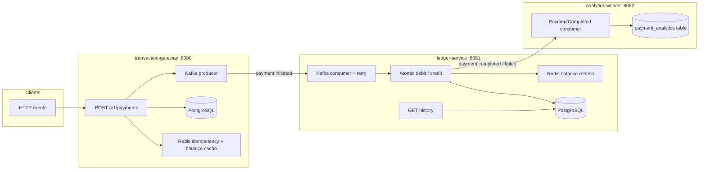

# SwiftPay — Real-time P2P payment ledger

Java 21, Spring Boot 3.4, PostgreSQL, Kafka, Redis, OpenAPI, Docker, Kubernetes sample manifests, and GitHub Actions CI.

## Architecture



- **Gateway** persists `PENDING` rows, enforces **24h Redis idempotency** on `transaction_id`, checks **sender balance** via Redis with PostgreSQL fallback, then publishes `PaymentInitiated`.
- **Ledger** consumes events with **exponential backoff retries** (transient DB/Kafka issues), applies **one transactional debit + credit**, updates `payments`, publishes `PaymentCompleted` or `PaymentFailed`, and refreshes Redis balances.
- **Analytics worker** (bonus) appends completed payments to `payment_analytics` (ClickHouse-shaped OLAP path can swap in later).

## Code quality and architecture

- **Separation of layers**
  - Controllers expose transport contracts only (request/response + status codes).
  - Services implement payment orchestration and ledger business rules.
  - Repositories/JDBC components isolate persistence access.
  - Kafka/Redis/OpenAPI setup is kept in dedicated configuration/infrastructure classes.
- **Modular design**
  - `swiftpay-common` contains shared cross-service contracts (events, topics, migrations).
  - `transaction-gateway`, `ledger-service`, and `analytics-worker` each own a focused runtime responsibility.
  - The parent Maven build keeps module dependencies explicit and review-friendly.
- **Meaningful naming**
  - Domain identifiers use business terms (`transactionId`, `senderId`, `receiverId`).
  - Monetary fields are stored as integer cents (`amountCents`, `balance_cents`) to avoid floating-point issues.
  - Event and service names mirror behavior (`PaymentInitiatedEvent`, `IdempotencyService`, `LedgerTransferService`).

## Quick start (Docker Compose)

```bash
docker compose up --build
```

If your environment uses standalone Compose (as in this setup), use:

```bash
docker-compose up --build
```

- Gateway: `http://localhost:8080/swagger-ui/index.html` — `POST /v1/payments`
- Ledger history: `http://localhost:8081/swagger-ui/index.html` — `GET /v1/users/{userId}/transactions`
- Health: `GET http://localhost:8080/health` (and `:8081`, `:8082`)

Demo accounts (seeded): `user-alice` → `user-bob` (see Flyway `V2__seed_demo_accounts.sql`).

### Example payment

```bash
curl -s -X POST http://localhost:8080/v1/payments \
  -H 'Content-Type: application/json' \
  -d '{
    "transactionId": "demo-001",
    "senderId": "user-alice",
    "receiverId": "user-bob",
    "amount": "12.34",
    "currency": "USD"
  }'
```

## Local development (infra in Docker, apps in IDE)

```bash
docker compose up postgres redis kafka zookeeper
export DB_HOST=localhost KAFKA_BOOTSTRAP=localhost:9092 REDIS_HOST=localhost
# Terminal 1 — run migrations + consumer
mvn -pl ledger-service spring-boot:run
# Terminal 2
mvn -pl transaction-gateway spring-boot:run
# Terminal 3 (optional)
mvn -pl analytics-worker spring-boot:run
```

## Build and test

Maven is required. On macOS with Homebrew:

```bash
brew install maven
# ensure brew is on PATH, e.g.:
export PATH="/opt/homebrew/bin:$PATH"
mvn verify
```

This repo also includes the **Maven Wrapper** (no global Maven needed after the first download):

```bash
chmod +x mvnw   # once, if needed
./mvnw verify
```

CI (`.github/workflows/ci.yml`) runs `mvn verify` and builds all Docker images.

## Error handling (non-functional requirements)

| Situation | Behavior |
|-----------|----------|
| **Insufficient funds** | Gateway returns `422` with `INSUFFICIENT_FUNDS`; ledger may still mark `FAILED` if a race slips past the pre-check. |
| **Duplicate `transaction_id`** | Cached `202` body from Redis within TTL; in-flight duplicates return `409` with `IDEMPOTENCY_IN_PROGRESS`. |
| **Kafka unavailable on publish** | The `PENDING` row is already committed when publish runs (`afterCommit`). The gateway surfaces `503` / `KafkaException` envelope, clears the idempotency lease, and the client can retry the same `transaction_id` (ledger guards finality via `payments.status`). |
| **DB constraint violation** | Gateway maps to `409` `DATA_CONSTRAINT_VIOLATION`. |
| **Ledger consumer / DB** | `DefaultErrorHandler` + exponential backoff; manual acks after successful processing. |

## Load test (~250 RPS, ~1M requests) and PCAP

With the stack running:

```bash
# optional: capture gateway port (interface name varies by OS)
# macOS example:
# sudo tcpdump -i lo0 -w swiftpay-8080.pcap tcp port 8080

k6 run scripts/load/k6-payments.js
```

Tune `GATEWAY_URL` if needed: `GATEWAY_URL=http://host:8080/v1/payments k6 run scripts/load/k6-payments.js`.

## Load test evidence and PCAP submission

- Load script in repo: `scripts/load/k6-payments.js`
- Target profile: `250` iterations/sec for `4000s` (about `1,000,000` requests attempted)
- Generated capture artifacts (local run):
  - `swiftpay-full.pcap` (broad service traffic capture)
  - `kafka-only.pcap` (explicit Kafka proof on `9092`)
  - `swiftpay-final.pcap` (merged final artifact for submission)
- Local packet preview command:
  ```bash
  tcpdump -nn -c 50 -r swiftpay-final.pcap
  ```

In this machine, host-level capture on `lo0` required elevated permissions, so capture was taken via container namespace tooling while sending load to `transaction-gateway:8080`.

**PCAP evidence methodology (reviewer note):** Packet capture is started immediately before load generation and stopped after traffic generation completes. Captures are taken from service/container network namespaces to avoid host permission limitations, then merged into `swiftpay-final.pcap` using `mergecap`. The final artifact was validated with `tcpdump -r` filters for `8080` (API), `9092` (Kafka), `5432` (PostgreSQL), and `6379` (Redis), confirming readable, non-empty packets for client-to-service and backend service communication during the load-test window.

Note: `.pcap`/`.pcapng` are git-ignored by design. Submit the PCAP file as an external artifact (zip/upload in submission portal or release asset) rather than committing it to source control.

## Kubernetes

Example manifests: `k8s/apps.yaml`. Bring your own PostgreSQL, Redis, and Kafka Services matching the ConfigMap hostnames (or edit the ConfigMap). Build and push images, then update image names in the Deployments.

## Module layout

| Module | Role |
|--------|------|
| `swiftpay-common` | Events, topic names, Flyway SQL |
| `transaction-gateway` | REST API, Redis idempotency, Kafka producer |
| `ledger-service` | Flyway execution, Kafka consumer, ledger + history API |
| `analytics-worker` | `PaymentCompleted` → `payment_analytics` |

## License

Proprietary — hackathon / evaluation use unless stated otherwise.
